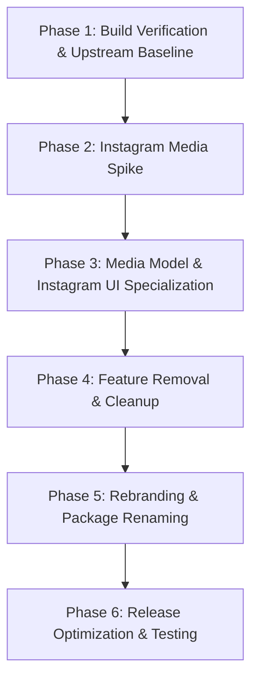

# INSTAFLOW ENGINEERING TRANSFORMATION PLAN

## 1. Executive Summary

This document defines the 6-phase engineering roadmap for transforming the cloned **Seal** codebase into **InstaFlow**. 

> [!IMPORTANT]
> **Sequence Optimization**: Rebranding and package renaming are deferred to Phase 5. Keeping package names identical to upstream Seal during technical spikes (Phases 1-4) ensures small diffs, seamless comparison with upstream commits, and hassle-free merging of upstream fixes.

---

## 2. Phase-by-Phase Transformation Roadmap

### Phase 1: Build Verification & Upstream Baseline
- **Objective**: Compile upstream Seal cleanly without modifications, execute test suite, and establish baseline performance metrics.
- **Verification Commands**:
  - `./gradlew assembleDebug`
  - `./gradlew testDebugUnitTest`
  - `./gradlew ktlintCheck`

### Phase 2: Instagram Media Spike
- **Objective**: Test and verify live extraction behavior against Instagram URLs:
  - Single Images
  - Single Videos / Reels
  - Mixed Carousel Posts
  - Stories & Highlights (with Cookie session)
  - Profile Pictures
- **Deliverable**: `InstagramMediaExtractor` prototype with `yt-dlp` and GraphQL fallback options.

### Phase 3: Media Model & Instagram UI Specialization
- **Objective**: Implement Instagram-native Compose UI components.
- **Target Files**:
  - Replace [`DownloadSettingsDialog.kt`](file:///C:/Users/JISHNU%20PG/Music/InstaFlow/InstaFlow/app/src/main/java/com/junkfood/seal/ui/page/download/DownloadSettingsDialog.kt) with Instagram Action Sheet.
  - Replace [`PlaylistSelectionDialog.kt`](file:///C:/Users/JISHNU%20PG/Music/InstaFlow/InstaFlow/app/src/main/java/com/junkfood/seal/ui/page/download/PlaylistSelectionDialog.kt) with Carousel Swipe & Select composable.
  - Extend [`DownloadedVideoInfo.kt`](file:///C:/Users/JISHNU%20PG/Music/InstaFlow/InstaFlow/app/src/main/java/com/junkfood/seal/database/objects/DownloadedVideoInfo.kt) schema (`mediaType`, `instagramUsername`, `captionText`).

### Phase 4: Feature Removal & Cleanup
- **Objective**: Strip out features irrelevant to Instagram.
- **Removed Features**: SponsorBlock, Subtitle UI, generic site selection options, YouTube-specific preferences in [`PreferenceUtil.kt`](file:///C:/Users/JISHNU%20PG/Music/InstaFlow/InstaFlow/app/src/main/java/com/junkfood/seal/util/PreferenceUtil.kt).

### Phase 5: Rebranding & Package Renaming
- **Objective**: Refactor namespace and application branding.
- **Tasks**:
  - Rename package `com.junkfood.seal` → `com.instaflow.app`.
  - Update `applicationId` and namespace in [`app/build.gradle.kts`](file:///C:/Users/JISHNU%20PG/Music/InstaFlow/InstaFlow/app/build.gradle.kts).
  - Update app icons, launcher labels, and string resources (`app_name`).

### Phase 6: Release Optimization & Testing
- **Objective**: Final quality assurance, performance profiling, accessibility auditing, and release packaging.
- **Verification Commands**:
  - `./gradlew assembleRelease`
  - `./gradlew testDebugUnitTest`
  - `./gradlew connectedDebugAndroidTest`
