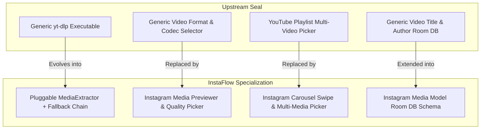

# INSTAFLOW SUBSYSTEM COMPARISON MATRIX

## Seal Upstream vs. InstaFlow Specialized Requirements

---

## Subsystem Comparison Table

| Subsystem | Upstream Seal Capability | InstaFlow Requirement | Transformation Strategy |
| :--- | :--- | :--- | :--- |
| **Download Pipeline** | Generic multi-site CLI execution via [`Downloader.kt`](file:///C:/Users/JISHNU%20PG/Music/InstaFlow/InstaFlow/app/src/main/java/com/junkfood/seal/Downloader.kt) | Specialized Instagram Reels, Carousels, Stories, and High-Res Posts extraction | Reuse `youtubedl-android` task runner in [`DownloaderV2.kt`](file:///C:/Users/JISHNU%20PG/Music/InstaFlow/InstaFlow/app/src/main/java/com/junkfood/seal/download/DownloaderV2.kt). Add fallback native GraphQL JSON extraction when `yt-dlp` encounters rate limits. |
| **Format Selection** | Codec ladders (H.264, VP9, AV1, MP3, OPUS) and resolution pickers (1080p, 720p, 480p) in [`DownloadSettingsDialog.kt`](file:///C:/Users/JISHNU%20PG/Music/InstaFlow/InstaFlow/app/src/main/java/com/junkfood/seal/ui/page/download/DownloadSettingsDialog.kt) | Direct Instagram video/image quality selection (Highest Quality, Compressed, Audio Only) | Replace codec picker UI with Instagram Media Action Sheet. |
| **Batch / List Downloads** | YouTube Playlist index selection via [`PlaylistSelectionDialog.kt`](file:///C:/Users/JISHNU%20PG/Music/InstaFlow/InstaFlow/app/src/main/java/com/junkfood/seal/ui/page/download/PlaylistSelectionDialog.kt) | Mixed Instagram Carousel posts (up to 10/20 images and videos) | Replace playlist index dialog with an interactive Carousel Swipe & Select composable. |
| **Authentication & Cookies** | Manual Netscape `cookies.txt` import via [`CookiesViewModel.kt`](file:///C:/Users/JISHNU%20PG/Music/InstaFlow/InstaFlow/app/src/main/java/com/junkfood/seal/ui/page/settings/network/CookiesViewModel.kt) | Instagram In-App Session Sync (Stories & Private Posts access) | Keep Netscape export engine in [`FileUtil.kt`](file:///C:/Users/JISHNU%20PG/Music/InstaFlow/InstaFlow/app/src/main/java/com/junkfood/seal/util/FileUtil.kt). Add embedded WebView cookie scraper. |
| **History & Database** | Basic title, URL, and thumbnail storage in [`DownloadedVideoInfo.kt`](file:///C:/Users/JISHNU%20PG/Music/InstaFlow/InstaFlow/app/src/main/java/com/junkfood/seal/database/objects/DownloadedVideoInfo.kt) | Instagram metadata (Creator @handle, post caption, media type badges) | Extend Room DB schema with version migration `MIGRATION_1_2`. |
| **Storage & Output** | SAF folder selection via [`PreferenceUtil.kt`](file:///C:/Users/JISHNU%20PG/Music/InstaFlow/InstaFlow/app/src/main/java/com/junkfood/seal/util/PreferenceUtil.kt) | Instagram organized folder structure (`/Pictures/InstaFlow/`, `/Movies/InstaFlow/`) | Reuse SAF framework in [`FileUtil.kt`](file:///C:/Users/JISHNU%20PG/Music/InstaFlow/InstaFlow/app/src/main/java/com/junkfood/seal/util/FileUtil.kt). Pre-configure default subdirectories for Instagram content. |
