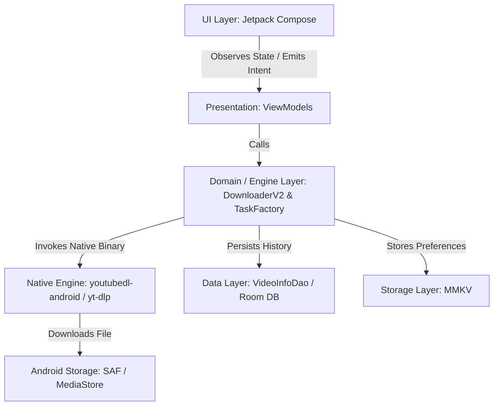

# System Architecture — JunkFood02/Seal

## 1. High-Level Architecture Overview

**Seal** follows a strict, single-activity, offline-first MVVM (Model-View-ViewModel) and Repository pattern powered by Jetpack Compose, Koin Dependency Injection, and Kotlin Coroutines/StateFlow.

---

## 2. Core Architectural Layers

### A. Presentation Layer (`com.junkfood.seal.ui`)
- Built 100% in **Jetpack Compose** using Material Design 3 and dynamic color palette extracted from system wallpaper or custom seed color (`:color` module).
- Managed via single [`MainActivity`](file:///C:/Users/JISHNU%20PG/Music/InstaFlow/InstaFlow/app/src/main/java/com/junkfood/seal/MainActivity.kt) housing [`AppEntry`](file:///C:/Users/JISHNU%20PG/Music/InstaFlow/InstaFlow/app/src/main/java/com/junkfood/seal/ui/page/AppEntry.kt) navigation graph.

### B. ViewModel Layer (`HomePageViewModel`, `DownloadDialogViewModel`, `VideoListViewModel`, `CookiesViewModel`)
- Exposes immutable UI state using `StateFlow` and `SharedFlow`.
- Instantiated and injected via Koin Compose DSL (`viewModel { ... }`).

### C. Download Engine Layer (`com.junkfood.seal.download`, `com.junkfood.seal.Downloader`)
- Orchestrates asynchronous media metadata extraction, format parsing, process execution (`youtubedl-android`), and task status updates.
- Uses [`DownloadService`](file:///C:/Users/JISHNU%20PG/Music/InstaFlow/InstaFlow/app/src/main/java/com/junkfood/seal/DownloadService.kt) as a foreground service to maintain lifecycle stability when the app is in the background.

### D. Data & Storage Layer (`com.junkfood.seal.database`, `com.junkfood.seal.util`)
- **Room Database (`AppDatabase`)**: Stores download history ([`DownloadedVideoInfo`](file:///C:/Users/JISHNU%20PG/Music/InstaFlow/InstaFlow/app/src/main/java/com/junkfood/seal/database/objects/DownloadedVideoInfo.kt)), cookie profiles ([`CookieProfile`](file:///C:/Users/JISHNU%20PG/Music/InstaFlow/InstaFlow/app/src/main/java/com/junkfood/seal/database/objects/CookieProfile.kt)), command templates, and format shortcuts.
- **MMKV**: High-speed binary key-value preference store handling user settings, download directory URIs, format defaults, and aria2 configuration.
