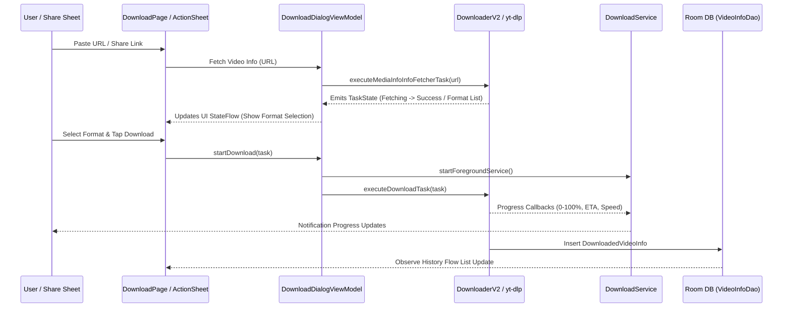

# Reactive Data Flow Architecture

The data flow in Seal relies on Kotlin `StateFlow`, `SharedFlow`, and Room `Flow` queries to maintain unidirectional data flow (UDF) from state sources to Jetpack Compose UI components.

---

## Unidirectional Data Flow (UDF) Patterns

1. **User Intent**: User enters URL or triggers action sheet.
2. **ViewModel State Mutation**: ViewModel processes intent, updates internal `MutableStateFlow<UiState>`, and exposes immutable `StateFlow<UiState>`.
3. **Composable Recomposition**: Compose views collect state via `collectAsStateWithLifecycle()` and re-render automatically.
4. **Database Reactivity**: Room DAO methods return `Flow<List<DownloadedVideoInfo>>`, allowing history lists to reflect new downloads instantly without polling.
