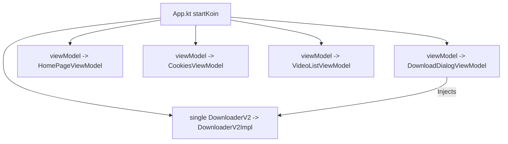

# Dependency Injection Graph — Koin DSL

**Seal** uses **Koin 4.0.0** (`io.insert-koin`) for compile-time safe, pragmatic dependency injection configured inside [`App.kt`](file:///C:/Users/JISHNU%20PG/Music/InstaFlow/InstaFlow/app/src/main/java/com/junkfood/seal/App.kt).



## Module Definitions (`App.kt` lines 65-74)

```kotlin
startKoin {
    androidLogger()
    androidContext(this@App)
    modules(
        module {
            single<DownloaderV2> { DownloaderV2Impl(androidContext()) }
            viewModel { DownloadDialogViewModel(downloader = get()) }
            viewModel { HomePageViewModel() }
            viewModel { CookiesViewModel() }
            viewModel { VideoListViewModel() }
        }
    )
}
```

### Injected Components
1. **`DownloaderV2`**: Injected as a singleton (`single`), providing concurrent task queue handling.
2. **`DownloadDialogViewModel`**: Receives `DownloaderV2` via `get()` to trigger media extraction and queue downloads.
3. **`HomePageViewModel`**, **`CookiesViewModel`**, **`VideoListViewModel`**: ViewModels managed by Koin's lifecycle extension.
