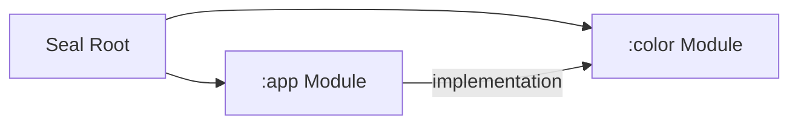

# Module Map — JunkFood02/Seal

The project is structured into two Gradle modules:

## 1. `:app` Module
- **Type**: Android Application (`com.android.application`)
- **Path**: [`app/`](file:///C:/Users/JISHNU%20PG/Music/InstaFlow/InstaFlow/app)
- **Namespace**: `com.junkfood.seal`
- **Responsibilities**:
  - Houses application entry point ([`App.kt`](file:///C:/Users/JISHNU%20PG/Music/InstaFlow/InstaFlow/app/src/main/java/com/junkfood/seal/App.kt)) and Activities ([`MainActivity`](file:///C:/Users/JISHNU%20PG/Music/InstaFlow/InstaFlow/app/src/main/java/com/junkfood/seal/MainActivity.kt), [`QuickDownloadActivity`](file:///C:/Users/JISHNU%20PG/Music/InstaFlow/InstaFlow/app/src/main/java/com/junkfood/seal/QuickDownloadActivity.kt)).
  - All Compose UI pages, ViewModels, and navigation graphs.
  - Download engine logic (`Downloader.kt`, `DownloaderV2.kt`).
  - Room DB (`AppDatabase`), DAO, and MMKV preferences.

## 2. `:color` Module
- **Type**: Android Library (`com.android.library`)
- **Path**: [`color/`](file:///C:/Users/JISHNU%20PG/Music/InstaFlow/InstaFlow/color)
- **Responsibilities**:
  - Dynamic color generation and HSL palette extraction algorithms.
  - Generates cohesive Material 3 color schemes for dynamic wall-paper seeds and custom user accent colors.
