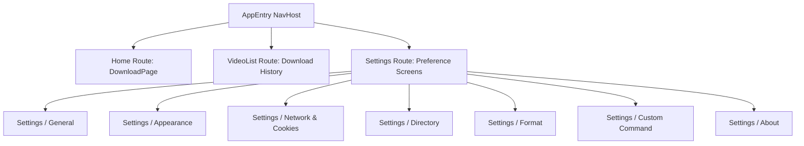

# Navigation Graph & Destination Routes

Seal uses Navigation Compose (`androidx.navigation.compose.NavHost`) configured inside [`AppEntry.kt`](file:///C:/Users/JISHNU%20PG/Music/InstaFlow/InstaFlow/app/src/main/java/com/junkfood/seal/ui/page/AppEntry.kt).

---

## Destination Routes Table

| Route Name | Target Composable | Description |
| :--- | :--- | :--- |
| `home` | [`DownloadPage.kt`](file:///C:/Users/JISHNU%20PG/Music/InstaFlow/InstaFlow/app/src/main/java/com/junkfood/seal/ui/page/download/DownloadPage.kt) | Main URL input screen, quick paste button, and format dialog launcher. |
| `download_v2` | [`DownloadPageV2.kt`](file:///C:/Users/JISHNU%20PG/Music/InstaFlow/InstaFlow/app/src/main/java/com/junkfood/seal/ui/page/downloadv2/DownloadPageV2.kt) | Task-based interactive action sheet and download queue monitor. |
| `video_list` | `VideoListPage.kt` | Download history list with search, filtering, and detail management. |
| `settings` | [`SettingsPage.kt`](file:///C:/Users/JISHNU%20PG/Music/InstaFlow/InstaFlow/app/src/main/java/com/junkfood/seal/ui/page/settings/SettingsPage.kt) | Settings hub providing navigation into preference sub-pages. |
| `settings_network` | `NetworkPreferencePage.kt` | Cookie management, proxy settings, user-agent configuration. |
| `settings_format` | `FormatPreferencePage.kt` | Default resolution, audio format, aria2 multi-threading options. |
| `settings_directory` | `DirectoryPreferencePage.kt` | SAF folder selection, custom file template string builder. |
