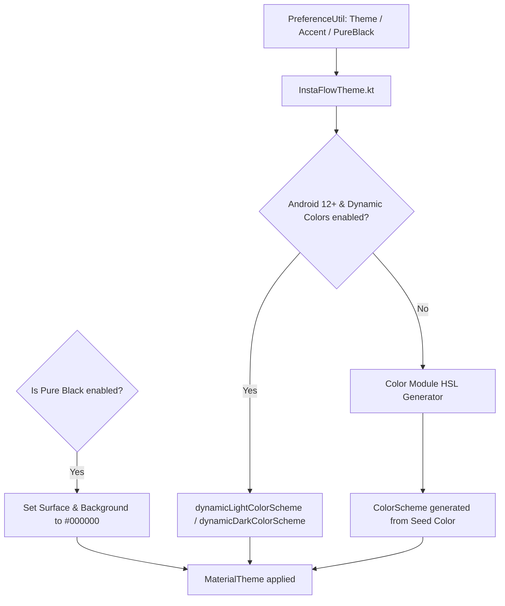

# Theme System & Dynamic Color Engine (`:color` Module)

## 1. Subsystem Overview

The theme system in InstaFlow manages dark/light mode preference switching, Amoled pure-black theme support, and dynamic accent color generation.

---

## 2. Dynamic Color Extraction (`:color` Module)

The `:color` library implements HSL-based color extraction algorithms:
- Converts a single seed hex color into tonal palettes:
  - Primary (Tones 10..99)
  - Secondary (Tones 10..99)
  - Tertiary (Tones 10..99)
  - Neutral & Neutral Variant (Tones 10..99)
- Outputs standard `androidx.compose.material3.ColorScheme` objects.

---

## 3. Amoled Pure-Black Dark Mode

When `PreferenceUtil.isPureBlackEnabled()` is true:
- Overrides `colorScheme.surface` and `colorScheme.background` to `#000000` (Pitch Black).
- Optimizes battery usage on OLED screens and provides ultra-high contrast UI.
