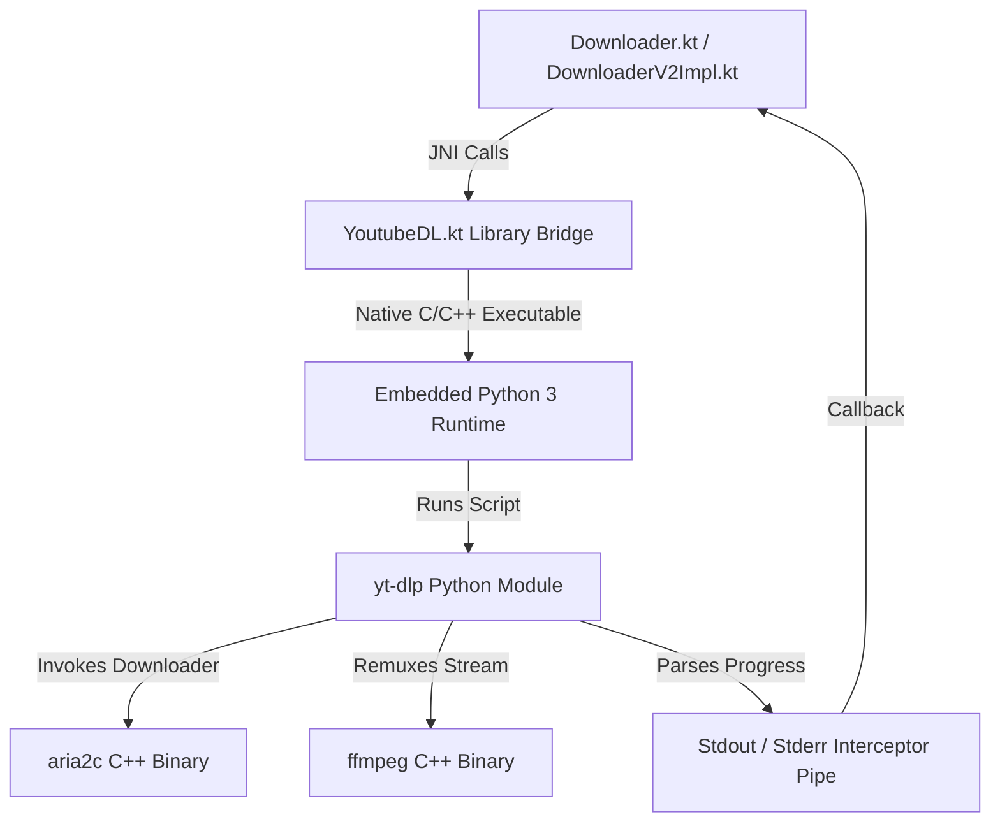

# Download Engine Architecture (`youtubedl-android` Native Execution)

## 1. Native Execution Engine Overview

The core extraction and download engine of Seal is powered by **`youtubedl-android`** (forked and published under `io.github.junkfood02.youtubedl-android`).



---

## 2. Native Binary Initialization ([`App.kt`](file:///C:/Users/JISHNU%20PG/Music/InstaFlow/InstaFlow/app/src/main/java/com/junkfood/seal/App.kt))

During application startup, `App.kt` initializes the native libraries asynchronously on `Dispatchers.IO`:

```kotlin
applicationScope.launch(Dispatchers.IO) {
    YoutubeDL.init(this@App)
    FFmpeg.init(this@App)
    Aria2c.init(this@App)
}
```

This extracts executable native binaries (`libyoutubedl.so`, `libffmpeg.so`, `libaria2c.so`) and Python environment into private app storage (`/data/data/com.junkfood.seal/app_youtubedl/`).

---

## 3. Command Generation & Option Assembly

`Downloader.kt` and `DownloaderV2.kt` build `YoutubeDLRequest` option flags passed to `yt-dlp`:

- `-f` / `--format`: Specifies video/audio format selection string.
- `-o`: Output template path pointing to SAF or private storage.
- `--external-downloader`: Set to `aria2c` when multi-threaded downloading is enabled.
- `--external-downloader-args`: Configures aria2c connections (`-x 16 -s 16 -k 1M`).
- `--cookies`: Absolute path to active `cookies.txt` exported from Room DB.
- `--embed-metadata` / `--embed-thumbnail`: Embeds ID3 tags and cover art.
