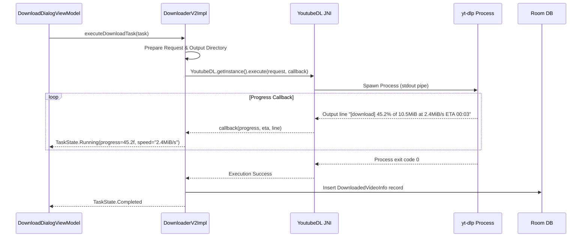

# Download Pipeline & Progress Callback Lifecycle

## 1. Pipeline Execution Flow

---

## 2. Progress Parsing Regex & Callbacks

`youtubedl-android` parses stdout lines matching:
`\[download\]\s+(\d+\.\d+)%\s+of\s+([~\d\.\w]+)\s+at\s+([\d\.\w/]+)\s+ETA\s+([\d:]+)`

- **Percentage**: Converted to floating point (`0.0f` to `100.0f`).
- **Download Speed**: E.g., `2.4MiB/s`.
- **ETA**: Estimated time remaining in `MM:SS`.
- **Total Bytes**: Extracted file size estimate.
