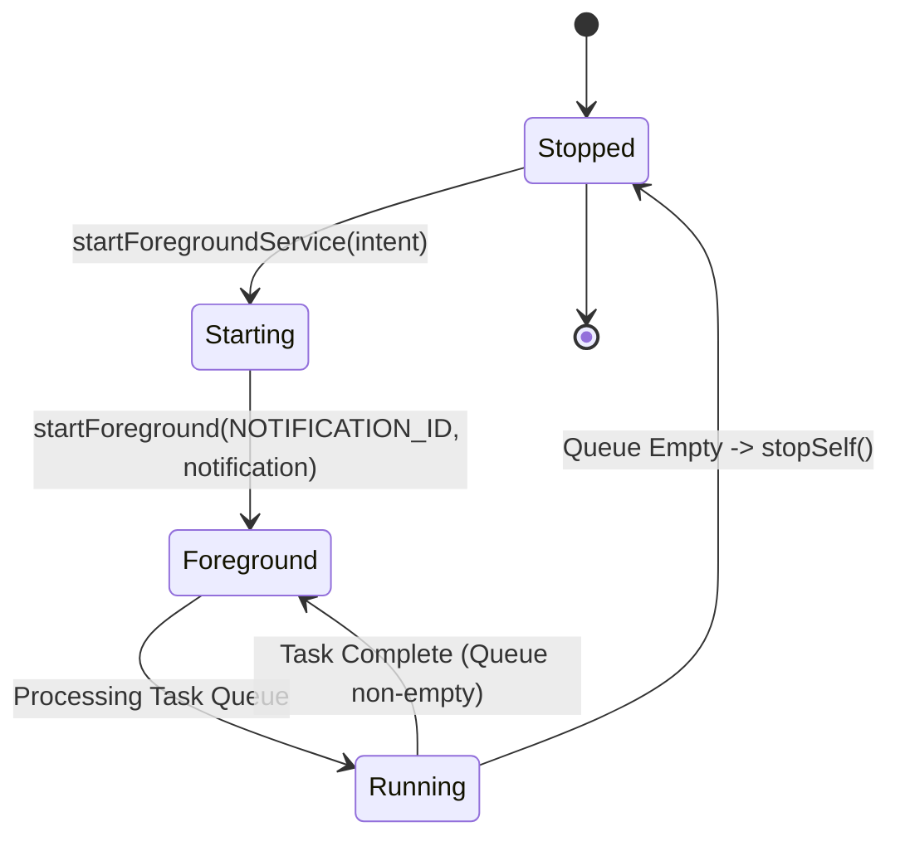

# Foreground Service & Background Execution Reference

## 1. Foreground Service (`DownloadService.kt`)

- **Class Path**: [`DownloadService.kt`](file:///C:/Users/JISHNU%20PG/Music/InstaFlow/InstaFlow/app/src/main/java/com/junkfood/seal/DownloadService.kt)
- **Type**: Android Foreground Service (`android.app.Service`)
- **Service Type**: `foregroundServiceType="dataSync"` (Android 14+ API 34 compatibility)
- **Responsibilities**:
  - Promotes download execution thread to foreground state with non-dismissible ongoing notification.
  - Prevents Android OS from killing the native `yt-dlp` process during long video downloads when the screen is off or app is backgrounded.
  - Handles `START_NOT_STICKY` command intents.

---

## 2. Service Binding & Lifecycle

