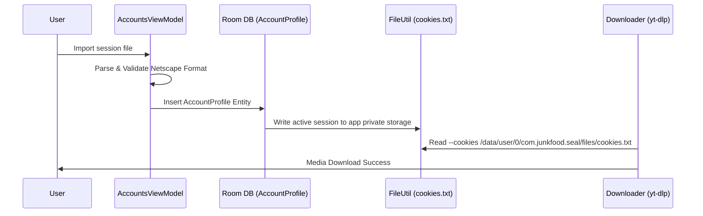

# Account System Architecture — Netscape Format & DB Backup

## 1. Subsystem Purpose

Enables media extraction for age-gated YouTube videos, private posts, or subscriber-only streams by injecting Netscape formatted session accounts into `yt-dlp` requests.

---

## 2. Account Lifecycle & Workflow

---

## 3. Storage Security Rules

- Account sessions are stored in Room database (`AccountProfile` table) and exported strictly to app-private internal storage (`/data/data/com.instaflow.app/files/cookies.txt`).
- Never committed to git or exposed to external apps.
