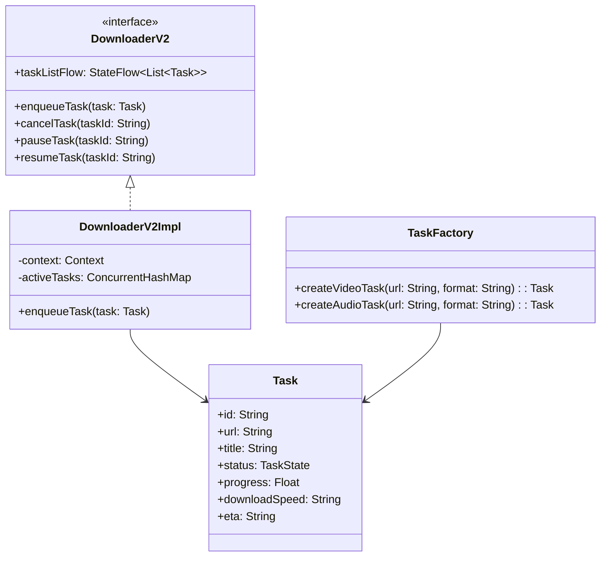
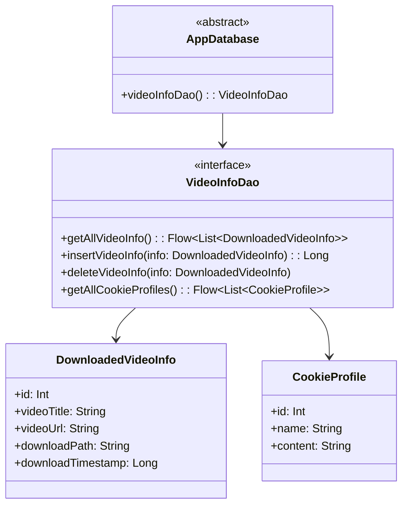

# Appendix: UML Class Diagrams

## 1. Downloader & Task Subsystem

```mermaid
classDiagram
    class DownloaderV2 {
        <<interface>>
        +taskListFlow: StateFlow~List~Task~~
        +enqueueTask(task: Task)
        +cancelTask(taskId: String)
        +pauseTask(taskId: String)
        +resumeTask(taskId: String)
    }

    class DownloaderV2Impl {
        -context: Context
        -activeTasks: ConcurrentHashMap
        +enqueueTask(task: Task)
    }

    class Task {
        +id: String
        +url: String
        +title: String
        +status: TaskState
        +progress: Float
        +downloadSpeed: String
        +eta: String
    }

    class TaskFactory {
        +createVideoTask(url: String, format: String): Task
        +createAudioTask(url: String, format: String): Task
    }

    DownloaderV2 <|.. DownloaderV2Impl
    DownloaderV2Impl --> Task
    TaskFactory --> Task
```

---

## 2. Database Layer Diagram

```mermaid
classDiagram
    class AppDatabase {
        <<abstract>>
        +videoInfoDao(): VideoInfoDao
    }

    class VideoInfoDao {
        <<interface>>
        +getAllVideoInfo(): Flow~List~DownloadedVideoInfo~~
        +insertVideoInfo(info: DownloadedVideoInfo): Long
        +deleteVideoInfo(info: DownloadedVideoInfo)
        +getAllCookieProfiles(): Flow~List~CookieProfile~~
    }

    class DownloadedVideoInfo {
        +id: Int
        +videoTitle: String
        +videoUrl: String
        +downloadPath: String
        +downloadTimestamp: Long
    }

    class CookieProfile {
        +id: Int
        +name: String
        +content: String
    }

    AppDatabase --> VideoInfoDao
    VideoInfoDao --> DownloadedVideoInfo
    VideoInfoDao --> CookieProfile
```
