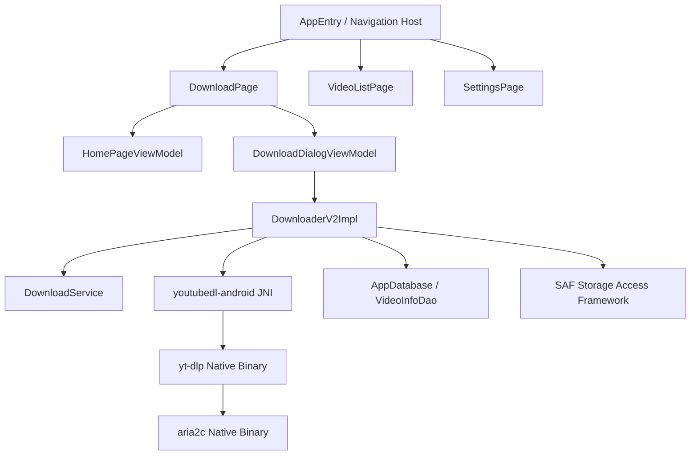
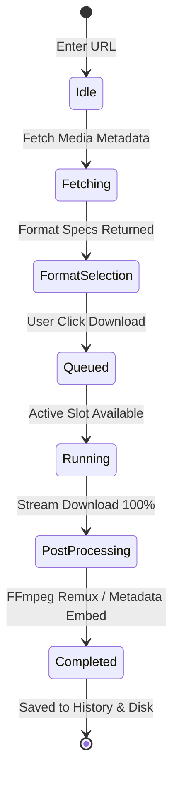
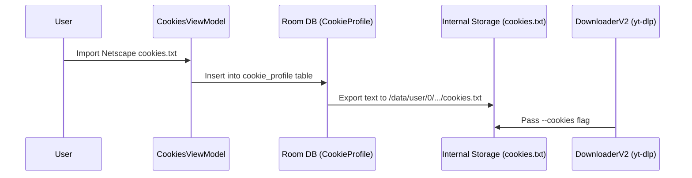

# Appendix: Master Mermaid Visual Catalog

## 1. Overall System Architecture

```mermaid
graph TD
    AppEntry[AppEntry / Navigation Host] --> Home[DownloadPage]
    AppEntry --> History[VideoListPage]
    AppEntry --> Settings[SettingsPage]

    Home --> VM_Home[HomePageViewModel]
    Home --> VM_Dialog[DownloadDialogViewModel]
    
    VM_Dialog --> Engine[DownloaderV2Impl]
    Engine --> Service[DownloadService]
    Engine --> JNI[youtubedl-android JNI]
    JNI --> YtDlp[yt-dlp Native Binary]
    YtDlp --> Aria2[aria2c Native Binary]
    
    Engine --> RoomDB[AppDatabase / VideoInfoDao]
    Engine --> Storage[SAF Storage Access Framework]
```

---

## 2. Download Execution State Flow

```mermaid
stateDiagram-v2
    [*] --> Idle: Enter URL
    Idle --> Fetching: Fetch Media Metadata
    Fetching --> FormatSelection: Format Specs Returned
    FormatSelection --> Queued: User Click Download
    Queued --> Running: Active Slot Available
    Running --> PostProcessing: Stream Download 100%
    PostProcessing --> Completed: FFmpeg Remux / Metadata Embed
    Completed --> [*]: Saved to History & Disk
```

---

## 3. Cookie Management Pipeline

```mermaid
sequenceDiagram
    participant User
    participant UI as CookiesViewModel
    participant DB as Room DB (CookieProfile)
    participant Disk as Internal Storage (cookies.txt)
    participant Engine as DownloaderV2 (yt-dlp)

    User->>UI: Import Netscape cookies.txt
    UI->>DB: Insert into cookie_profile table
    DB->>Disk: Export text to /data/user/0/.../cookies.txt
    Engine->>Disk: Pass --cookies flag
```
